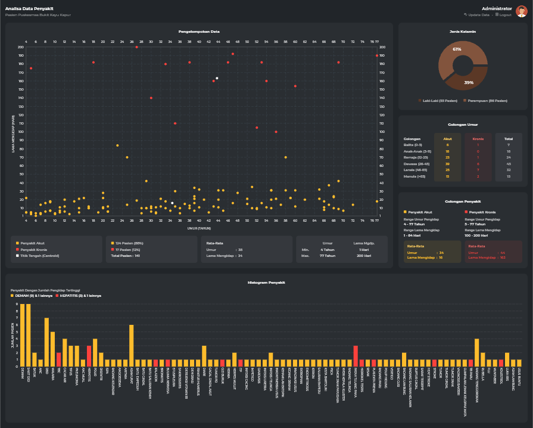

# Analysis of Patient Disease Data Using K-Means Clustering Algorithm

## About K-Means Clustering

K-means clustering is one of the simplest and popular unsupervised machine learning algorithms. Typically, unsupervised algorithms make inferences from datasets using only input vectors without referring to known, or labelled, outcomes.

A cluster refers to a collection of data points aggregated together because of certain similarities. You’ll define a target number k, which refers to the number of centroids you need in the dataset. A centroid is the imaginary or real location representing the center of the cluster. Every data point is allocated to each of the clusters through reducing the in-cluster sum of squares.

In other words, the K-means algorithm identifies k number of centroids, and then allocates every data point to the nearest cluster, while keeping the centroids as small as possible. The ‘means’ in the K-means refers to averaging of the data; that is, finding the centroid.

## K-Means Method

The following are the step-by-step of the K-Means method used in this project:

1.	Determine the number of clusters (K). Because in this project there will be a grouping of acute and chronic disease data, the number of K is 2.
2.	Set the cluster center. The center of the cluster can be determined arbitrarily, but so that the clustering results are better, determine the cluster center by calculating the median of the patient's overall age attributes and the highest and lowest length of time.

&nbsp;&nbsp;&nbsp;&nbsp;&nbsp;&nbsp; 

4.	Calculate the distance of each data to the center of the cluster. To calculate the distance used the Euclidean formula:

&nbsp;&nbsp;&nbsp;&nbsp;&nbsp;&nbsp; 

4.  Group data into a cluster with the shortest distance. A data will be a member of the J Cluster if the distance of the data to the central cluster is the smallest value when compared to the distance to the center of other clusters.
5.  Calculate the center of the cluster. The new cluster center value can be calculated by finding the average value of the data that is a member of the cluster, with the formula:

&nbsp;&nbsp;&nbsp;&nbsp;&nbsp;&nbsp; 

6.  Repeat steps 3-5 until there is no more data that moves to another cluster.

## Demo

Visit: [https://elriztechnology.com/apps/kmeans](https://www.elriztechnology.com/apps/kmeans)

Admin credential:

- username : admin
- password : 123456

